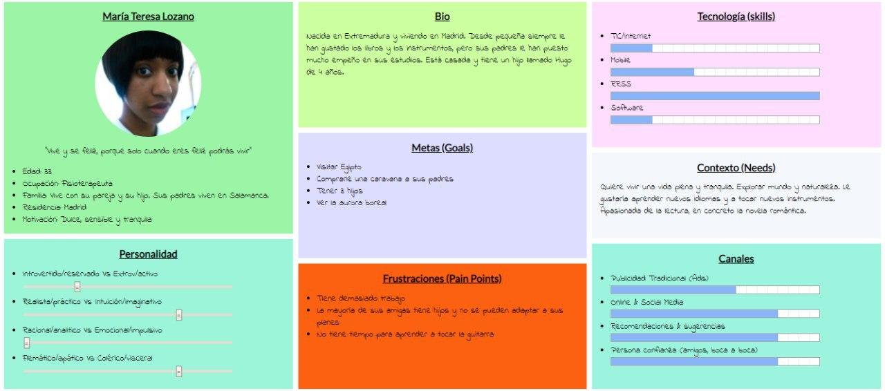

## UX Desk Research & Analisis
### 1.a Competitive Analysis
El informe usado para evaluar las distintas aplicaciones se ha sustituido [este artículo](https://www.mochileando.com/blog-de-herramientas/2019/2/15/mejores-aplicaciones-para-conectar-con-otros-viajeros) de un blog llamado **Mochileando**, debido a que el inicialmente ofrecido por el profesor no se encuentra disponible a día de hoy. Por tanto, se analizarán algunas de las aplicaciones listadas en ese artículo y se compararán con Pazifiko.

**Couchsurfing**: En los primeros días de la asignatura pensamos en tomar como iniciativa esta aplicación. Viéndola, podemos detectar varios errores

### 1.b Persona
En este apartado se van a explicar las personas ficticias que hemos creado como potenciales usuarios para la plataforma con el objetivo de encontrar conflictos y problemas en la experiencia de estos usuarios.

En primer lugar presentamos a Jose Luis, un estudiante de Bellas Artes con 21 años. Si bien tiene su grupo asentado de amigos, no se encuentra muy cómodo con desconocidos. Este sería el caso de una persona joven que quiere ir a conocer mundo, pero no ha encontrado a nadie que quiera acompañarle.

En segundo lugar, Maria Teresa es una mujer de 33 años, se dedica a la fisioterapia y vive en Madrid junto a su pareja y su hijo. Les gustaría irse de viaje y seguir acumulando experiencias y recuerdos juntos como familia.

### 1.c User Journey Map
