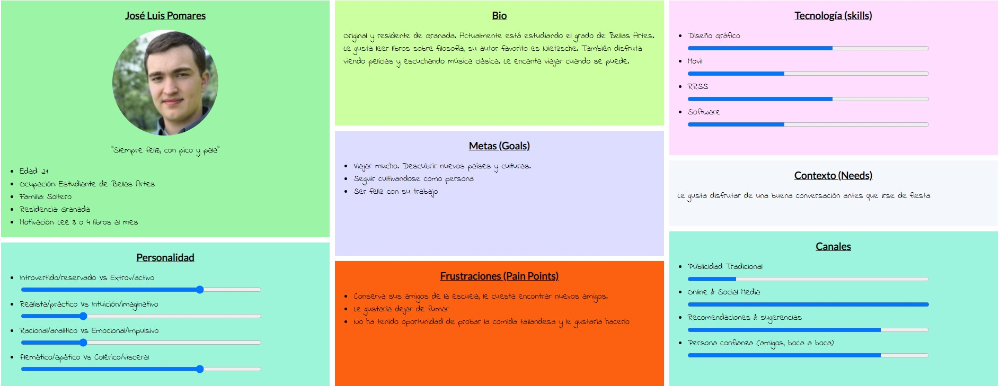

## UX Desk Research & Analisis
### 1.a Competitive Analysis
El informe usado para evaluar las distintas aplicaciones se ha sustituido [este artículo](https://www.mochileando.com/blog-de-herramientas/2019/2/15/mejores-aplicaciones-para-conectar-con-otros-viajeros) de un blog llamado **Mochileando**, debido a que el inicialmente ofrecido por el profesor no se encuentra disponible a día de hoy. Por tanto, se analizarán algunas de las aplicaciones listadas en ese artículo y se compararán con Pazifiko.

**Couchsurfing**: EEn los primeros días de la asignatura pensamos en tomar como iniciativa esta aplicación. Viéndola, podemos detectar varios errores. La página principal no ofrece grandes detalles sobre qué cosas se pueden encontrar, si tiene aplicación móvil, qué tipo de experiencias se ofertan, tampoco tiene un buscador... En esta página se muestra simplemente opciones de registro, junto con pequeños enlaces para inciar sesión y ver cómo funciona *(tenemos que cambiar de página totalmente para ver cómo funciona Couchsurfing)*. Decidimos descartarla en primera instancia.

**Flip the Trip**: A primera vista es una página bastante completa. Ofrece un buscador como primera opción nada mas entrar a la página, junto con eventos recientemennte publicados y personas que nos puedan resultar de interés. No dispone de enlaces adicionales en el pie de página, pero sí de aplicación móvil. Tampoco da opciones de registrarse mediante la página web si no que todos los trámites se hacen mediante la aplicación *(que por cierto solo está disponible para iOS)*. Consideramos que no se puede extraer mucho más de esta página y por ende también la descartamos.

**Meetup**: Una página web que además de ofrecer la posibilidad de crear un grupo de viaje mediante navegador también dispone de aplicaciones tanto para Android como para iOS. La página principal es llamativa y bastante atractiva, lo cual hace que la aplicación gane puntos. Conforme vamos avanzando por la página, vemos que algunas páginas están sobrecargadas de información.

Consideramos entonces que la mejor opción a escoger es Pazifika, en la que podemos ver claramente la información justa en todas las páginas, pero siendo esta información relevante para la experiencia de navegación del usuario. No obstante creemos que hay varios aspectos de la aplicación que se pueden mejorar y en los que centramos las prácticas de la asignatura.n los primeros días de la asignatura pensamos en tomar como iniciativa esta aplicación. Viéndola, podemos detectar varios errores

### 1.b Persona
En este apartado se van a explicar las personas ficticias que hemos creado como potenciales usuarios para la plataforma con el objetivo de encontrar conflictos y problemas en la experiencia de estos usuarios.

En primer lugar presentamos a Jose Luis, un estudiante de Bellas Artes con 21 años. Si bien tiene su grupo asentado de amigos, no se encuentra muy cómodo con desconocidos. Este sería el caso de una persona joven que quiere ir a conocer mundo, pero no ha encontrado a nadie que quiera acompañarle.

En segundo lugar, Maria Teresa es una mujer de 33 años, se dedica a la fisioterapia y vive en Madrid junto a su pareja y su hijo. Les gustaría irse de viaje y seguir acumulando experiencias y recuerdos juntos como familia.

### 1.c User Journey Map
