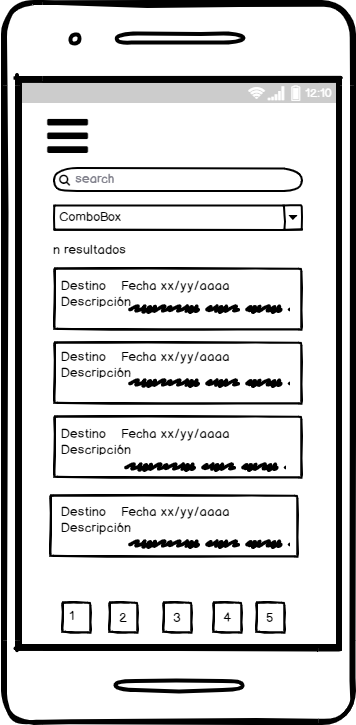
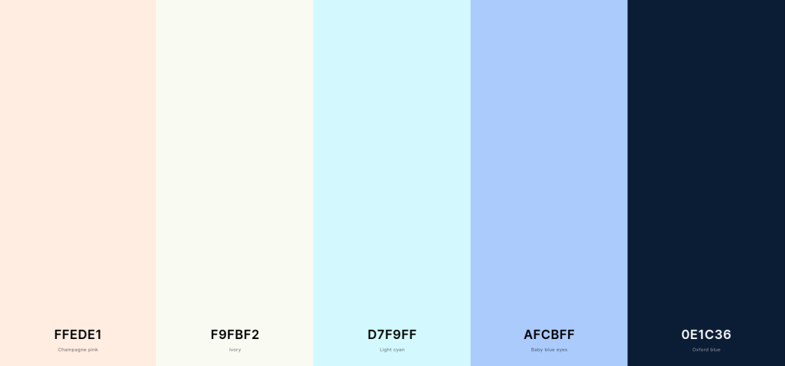

### Análisis de MuseMap
  
En el artículo dedicado al desarrollo de MuseMap vemos muchos detalles y muchas prácticas que ya hemos usado nosotros en prácticas anteriores.

Hay que destacar que una de las primeras prácticas que se mencionan en el artículo es el Competitive Analysis. A diferencia de nosotros que hicimos una breve descripción en la Práctica 1, en MuseMap desarrollaron una matriz en la que comparan diversos aspectos de otras aplicaciones con similar finalidad.

A continuación desarrollan un Empathy Map, al que dedicaron una sesión de brainstorming para obtener las cuestiones más relevantes a realizar a los usuarios que vayan a entrevistar. Esto es algo que nosotros no hicimos pero que sin duda es interesante mencionar. Acto seguido realizan entrevistas con diversos posibles usuarios seleccionados y les plantean las preguntas surgidas en esta sesión de brainstorming.

Después de realizar las entrevistas, desarrollaron un Affinity Mapping, también interesante para comparar las perspectivas que tienen los usuarios con las que pensaron los diseñadores en un principio. Ya obtenidas estas distintas opiniones, pasan a realizar dos personas ficticias tal y como hicimos nosotros, donde identifican las metas y los pain points de esas posibles personas tipo.

A raíz de eso comienzan a plantear los mapas de experiencia de los usuarios junto con el diagrama de flujo que seguirá un usuario en su aplicación. Finalmente comienzan a plantear ciertos bocetos iniciales a los que les acompaña el sitemap y los mockup finales.

La técnica que nos ha parecido más interesante es el Competitive Analysis. Han dedicado la primera parte del ciclo de desarrollo UX en ver y comparar las distintas aplicaciones disponibles en el mercado. Creemos que es una muy buena metodología a tener en cuenta a y dedicar tiempo para ver en qué fallan y en qué aciertan las posibilidades existentes, así como observar las opiniones de los usuarios con respecto a esas aplicaciones.

Creemos que es un muy buen ejemplo de historia ya que nuestras prácticas se adaptan correctamente a la metodología UX seguida por MuseMap.

### Patrones de Diseño y Guidelines

Tras una investigación exhaustiva acerca los patrones de diseño detallaremos los que tienen más sentido en nuestra interfaz. La principal fuente que hemos utilizados es la siguiente página: https://www.smashingmagazine.com/web-design-essentials-examples-and-best-practices/

Como se trata de una interfaz móvil, uno de los patrones que consideramos fundamental es el llamado *Call-to-Action Buttons* que consiste en implementar las funcionalidades a través de botones de modo que usuario con una simple vista sabe cuales son las funcionalidades que puede realizar.

También creemos adecuado el patrón *Progress Trackers* que consiste en mantener informado al usuario en el progreso que lleva realizado a la hora de realizar una acción, creemos que a la hora de rellenar los formularios para publicar un viaje es necesario que el usuario sepa en todo momento cuánto le queda por terminar el proceso.

Otro patrón que usamos es el llamado *Search Results Design*. Consideramos que es importante un buen diseño de la página de resultados porque es una de las funcionalidades esenciales de nuestra aplicación, por lo que es importante que el diseño de esta sea el más cómodo para el usuario, proporcionando la cantidad de resultados obtenidos, un método para filtrar los resultados etc...

  

 

Basándonos en el guideline de Google, vemos una buena práctica mostrar el valor de nuestra aplicación en primer lugar de modo que nada más entrar a la página principal se pueda realizar una búsqueda para que el usuario que entre tenga claro que se trata de una aplicación para la búsqueda de compañeros de viaje. Siguiendo esto mismo pondremos la barra de búsqueda siempre en una posición destacada para que se el usuario la tenga fácilmente localizada. 

En cuanto a la fuente hemos decidido utilizar *Roboto*.

En cuanto a la paleta de colores hemos generado la de la imagen con la herramienta https://coolors.co/ . Hemos optado por esta ya que tiene tonos pastel que son agradables a la vista y harán que el usuario se sienta cómodo navegando por nuestra aplicación, además presenta predominancia del color azul el cual se sabe que es uno de los colores favoritos, independientemente del género como presentan diversos estudios.

  
 

### Cuenta tu historia

### Conclusiones
En esta práctica hemos aprendido a analizar una experiencia de desarollo de aplicación y estamos viendo que lo que estamos haciendo en las prácticas de la asignatura se adapta a lo que se hace en situaciones reales.

Hemos realizado una buena búsqueda y lecturas de los distintos patrones que se usan para el diseño, así como las posibles fuentes y colores que podríamos usar en nuestra aplicación,
ya que aunque en un principio pueda parecer una decisión trivial no lo es, es importante que el usuario sepa en cada momento cuáles son las acciones que puede realizar o el progreso que lleva al rellenar un formulario. Otros detalles como la paleta de colores o la fuente son también importantes pues están directamente relacionados con la experiencia de usuario que tendrá un usuario al navegar en nuestra aplicación

Los problemas que nos hemos encontrado han sido al intentar modificar los bocetos. La aplicación que utilizamos no da la opción para cambiar la fuente o los colores del boceto.
