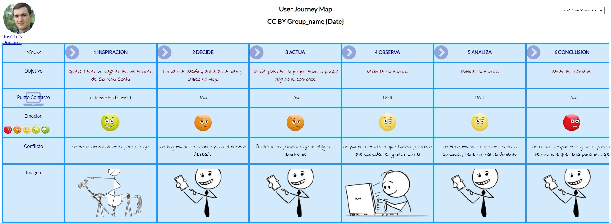

# DIU20
Prácticas Diseño Interfaces de Usuario 2019-20 (Economía Colaborativa) 

Grupo: DIU1_Cohete.  Curso: 2019/20 

Proyecto: Pazifika

Descripción: Pretendemos desarrollar una aplicación para poder buscar compañeros de viaje de una manera sencilla y ágil, con muchas opciones para filtrar por viajes y una interfaz clara y limpia.

Logotipo: 

Miembros
 * :bust_in_silhouette:   Francisco Domínguez Lorente     :octocat:     
 * :bust_in_silhouette:  Miguel Ángel Posadas Arráez     :octocat:

----- 

En esta práctica estudiaremos un caso de plataforma de economía colaborativa y realizaremos una propuesta para su diseño Web/movil. Utilizaremos herramientas y entregables descritos en el siguiente CheckList (https://github.com/mgea/UX-DIU-Checklist) 

Qué es economia colaborativa: Martínez-Polo, J. (2019). **El fenómeno del consumo colaborativo: del intercambio de bienes y servicios a la economía de las plataformas**, *Sphera Publica, 1*(19), 24-46. http://sphera.ucam.edu/index.php/sphera-01/article/view/363/14141434

>>> Este documento es el esqueleto del report final de la práctica. Aparte de subir cada entrega a PRADO, se debe actualizar y dar formato de informe final a este documento online. 

# Proceso de Diseño 

## Paso 1. UX Desk Research & Analisis 

 1.a Competitive Analysis
-----

Pazifiko es una plataforma que permite buscar compañeros de viaje, tanto organizar un viaje de modo que usuarios de la plataforma se unan,
como buscar viajes ya organizados por otros usuarios. Leímos sobre otra app llamada Miss travel, pero la rechazamos porque no estamos de acuerdo con sus ideales 

 1.b Persona
-----

José Luis representa la juventud que busca ir de fiesta y tiene limitaciones de estudiante.
María Teresa representa parejas jóvenes estables que viajan con hijos.

 1.c User Journey Map
----

Hemos elegido el perfil de Jose Luis en representación de nosotros ya que tenemos un perfil similar y es lo más similar en estas apps, también hemos elegido el perfil de Maria Teresa porque es poco común querer encontrar compañeros de viaje habiendo formado una familia.

 1.d Usability Review
----
- [Enlace al documento](https://github.com/migue99angel/DIU20/blob/master/P1/Usability-review-complete.pdf)
- Valoración final (numérica): 66
- Comentario sobre la valoración: En definitiva, la plataforma cumple con las expectativas de la misma pero carece enormemente de buena disponibilidad. Paros y cortes de servicio intermitentes y fallos habituales en la navegación.

## Paso 2. UX Design  

 2.a Feedback Capture Grid
----

| **Interesante**                                                                                                                                                                                                                                                     | **Críticas**                                                                                                                                                                                                                                                                                                                                                  |
|-----|-----|
| Diseño limpio. Se destaca lo importante y utiliza una paleta de colores agradable a la vista. Interfaz amigable. La información está concentrada y se destaca lo importante. El panel de control de usuario destaca las opciones importantes y es claro. | Añadir un sistema de mensajes para poder establecer contacto de manera más fácil con compañeros de viaje. Permitir la búsqueda de viajes por varios aspectos. Permitir añadir en la descripción el número de integrantes que se buscan y los integrantes que buscan compañeros.                                                                            |
| 
**Preguntas**
                                                                                                                                                                                                                                 | 
**Nuevas ideas**
                                                                                                                                                                                                                                                                                                                       |
| Hay un fallo a la hora de mostrar el mapa de ubicación. ¿Se podría mejorar? ¿Se podrían añadir más opciones para filtrar viajes? Estaría bien tener una opción adicional para hacer amigos en la plataforma y poder hacer viajes conjuntos.              | Mostrar ejemplos de viajes que estén activos actualmente, de diferentes categorías. Intentar que cuando un usuario se registre, este consiga publicar un viaje o se inscriba en uno existente en las primeras visitas del usuario. La plataforma no cuenta con redes sociales de ningún tipo. No se puede contactar con ellos más allá del correo. |
  
  
Proponemos una aplicación que incluya una gran variedad de opciones de búsqueda, así como poder publicar un viaje con las etiquetas suficientes para que personas con gustos similares puedan encontrar tu viaje más fácilmente.

Incorporamos también una galería de imágenes donde los viajeros puedan publicar las imágenes de sus viajes y otros usuarios puedan admirar los lugares donde recientemente han ido otros usuarios que han usado la plataforma

 2.b Tasks & Sitemap 
-----

**Matriz de Tareas/Usuarios**

| Grupos de Usuarios           | Usuario Logueado | Usuario No Logueado |
|------------------------------|------------------|---------------------|
| Iniciar Sesión               |                  | H                   |
| Registrarse                  |                  | M                   |
| Publicar Viaje               | M                |                     |
| Apuntarse a Viaje            | M                |                     |
| Consultar viajes disponibles | H                | M                   |
| Contactar con Soporte        | H                | M                   |
| Publicar un comentario       | M                |                     |

 

**Sitemap**  

 2.c Labelling 
----

| Etiqueta | Nota                                                                                                       |
|----------|------------------------------------------------------------------------------------------------------------|
| Buscar   | Herramienta para filtrar por viajes según a unos criterios que estima el usuario                           |
| Galería  | Recopilación de imágenes realizadas durante los distintos viajes de la plataforma que ya han tenido lugar  |
| Contacto | Página en la que se incluyen los distintos medios de contacto con el soporte técnico de la plataforma      |
| Viajes   | Sección donde se publican y se pueden ver los distintos viajes que se pretenden organizar en la plataforma |
| Perfil   | Sección donde se sitúan todas las opciones de configuración disponibles para el usuario                    |

 2.d Wireframes
-----

**Página principal**  
  
 

[Resto de wireframes](https://github.com/migue99angel/DIU20/tree/master/P2)

## Paso 3. Mi equipo UX-Case Study 

 3.a ¿Como se cuenta un UX-Case Study?
-----

Cuando una empresa empieza a diseñar una aplicación, primeramente hace un estudio previo sin tener en cuenta la opinión de los usuarios. Posteriormente, una vez hayan planteado
el esquema inicial de la aplicación, se entrevistan con los usuarios y obtienen los problemas y las preocupaciones reales de los usuarios potenciales. A continuación, comienzan
a desarrollar los mockups y bocetos en base a eso. 

En el siguiente enlace accedemos a una descripción más detallada. [Enlace a la especificación detallada](P3/README.md)

  3.b Logotipo
----

El logotipo diseñado es el siguiente:  

Hemos usado una herramienta online de logos prefabricados y la hemos adaptado a nuestras necesidades. La resolución empleada es la mejor que ofrecía la página mencionada
y creemos que es suficiente para la página. El logotipo se podría usar como foto de perfil en las redes sociales, pero se necesitarían más diseños para cubrir las cabeceras
y otros aspectos de los perfiles.

 3.c Guidelines
----

Hemos optado por aplicar los patrones *Call-to-Action Buttoms* para que el usuario tenga siempre presente que acciones puede realizar, así como *Progress Trackers* en los formularios ya que es importante conocer el progreso realizado miestras estos son rellenados y *Search Resulsts Design* ya que un buen diseño de la página de resultados en fundamental. 

En el siguiente enlace detallamos mucho más lo anteriormente comentado, así como comentar los detalles que hemos utilizado siguiendo la guideline de Google y especificación de la paleta de colores y fuente utilizada. [Enlace a la especificación detallada](P3/README.md)

  3.d Vídeo
----

https://drive.google.com/open?id=1sPXz_SW_37V6XT4Jr1sQY5hqU069t2Sx

## Paso 4. Evaluación 

 4.a Casos asignados
----

### Caso 1

Para el primer caso los compañeros han analizado una plataforma de economía colaborativa para la organización de viajes o incluso la búsqueda de compañero de viaje. Como propuesta de valor sobre la página que han analizado en la práctica 1 proponen principalmente una mejora del deiseño de la página principal.   

[Repositorio](https://github.com/raulsoria98/DIU20) || [Hoja de evaluación](https://github.com/migue99angel/DIU20/blob/master/P4/DIU1.HOOKAH_review.xlsx)

### Caso 2

Para este caso 2, el compañero ha analizado una aplicación para alquiler de pisos por habitaciones o completos, incluyendo una agenda cultural para ver los eventos cercanos a los nuevos alojamientos. Como propuesta de valor, se aporta que la agenda cultural sea más completa de modo que se puedan añadir eventos a la misma así como observar los eventos antes de alquilar una habitación, de modo que estos eventos aporten un valor añadido a cada habitación. También propone la introducción de ayudas como comandos de voz.

[Repositorio](https://github.com/Jovalga/DIU20) || [Hoja de evaluación](https://github.com/migue99angel/DIU20/blob/master/P4/DIU2.JVG_review.xlsx)

### Caso 3

Para el caso 3 los compañeros han analizado una aplicación para aprender a cocinar en vivo, degustar comida y hacer tours gastronómicos. Como propuesta de valor los compañeros proponen la creación de un diseño en el que prime la eficiencia y la velocidad del sistema ya que en el análisis de la práctica 1 han detectado que el principal problema de la plataforma que analizaban era el tiempo invertido por parte del usuario en el uso de la aplicación. 

[Repositorio](https://github.com/Mxgang/DIU20) || [Hoja de evaluación](https://github.com/migue99angel/DIU20/blob/master/P4/DIU3.Crescendum_review.xlsx)

 4.b User Testing
----

Hemos escogido como persona ficticia a [María Teresa](https://github.com/migue99angel/DIU20/raw/master/img/persona2.jpg). Recordamos que esta persona ficticia tenía pareja y un hijo. Vive con su pareja en Madrid, es fisioterapeuta y le gustan los viajes tranquilos.

### Experiencia 1
A María Teresa le surge la misma preocupación que con Pazifika. Ella y su familia desea hacer un viaje con otra pareja de estructura similar: una pareja con un hijo. María Teresa no sabe si PlanBClub tendrá las opciones y los filtros disponibles para poder satisfacer todas sus necesidades.

### Experiencia 2
María Teresa y su familia han alquilado un piso cerca de una zona céntrica de su próximo viaje a Budapest. No tienen mucho tiempo que perder ya que será un viaje corto. Ella y su familia ya han mirado los eventos cercanos e incluso habían obtenido las entradas de varios eventos. Cuando ya están en Budapest, se preparan para ir a uno de esos eventos en el teatro. Una vez llegan allí, les informan de que la obra se había cancelado varias horas antes por enfermedad de varios actores. No han tenido forma de saber que eso iba a pasar y la aplicación no les ha informado de la situación.

### Experiencia 3
María Teresa y su familia quieren probar un sitio nuevo para cenar cerca de su urbanización. Un amigo de la pareja de María Teresa le recomienda una aplicación llamada SweetIt! Inicialmente ilusionados la pareja comienza a mirar los diversos restaurantes por categorías en los que pueden hacer una reserva. A medida que van viendo más restaurantes, se dan cuenta que en muy pocos de ellos se incluye una opción clara de "Menú Infantil", quizás directamente porque no tienen menú infantil en el restaurate, o porque no figura en la aplicación. Al final acaban recurriendo a una de las opciones de siempre al no tener información clara sobre el menú infantil para su hijo.

 4.c Ranking
----

Para concluir con la práctica, creemos que ha sido una práctica interesante de realizar porque hemos tenido que mirar en detalle el trabajo de nuestros compañeros: su propuesta de valor, cómo han efocado el diseño de su aplicación, los bocetos y una de las partes más interesantes: el vídeo de introducción a su propuesta de valor.

También nos ha parecido interesante el tener distintas temáticas entre los diferentes grupos. Con el primero de los grupos, al ser el mismo que el nuestro teníamos algo más de experiencia y familiarización, pero con los otros dos, al ser nuevos y tratar de temáticas algo diferentes ha sido curioso analizarlos y ver cómo han planteado sus prácticas.

Por último, para concluir con un pequeño ranking, queremos destacar el [Caso 2](https://github.com/Jovalga/DIU20), por su completitud y de una buena extensión y cuidando los detalles sobre todo del vídeo de introducción y de los bocetos. Los otros dos casos los ponemos un poco por debajo, pero ambos también son muy buenos y merecen también su reconocimiento.

## Paso 5. Evaluación de Accesibilidad  

  5.a Accesibility evaluation Report
----

>>> Indica qué pretendes evaluar (de accesibilidad) y qué resultados has obtenido + Valoración personal

>>> Evaluación de la Accesibilidad (con simuladores o verificación de WACG) 

## Conclusión / Valoración de las prácticas

>>> (90-150 caracteres) Opinión del proceso de desarrollo de diseño siguiendo metodología UX y valoración (positiva /negativa) de los resultados obtenidos  

