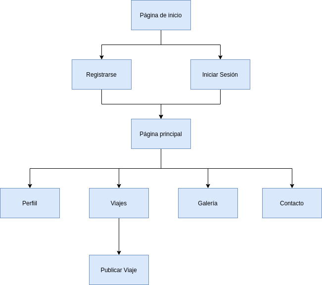

# DIU20
Prácticas Diseño Interfaces de Usuario 2019-20 (Economía Colaborativa) 

Grupo: DIU1_Cohete.  Curso: 2019/20 

Proyecto: 

Descripción: 

Logotipo: 

Miembros
 * :bust_in_silhouette:   Francisco Domínguez Lorente     :octocat:     
 * :bust_in_silhouette:  Miguel Ángel Posadas Arráez     :octocat:

----- 

En esta práctica estudiaremos un caso de plataforma de economía colaborativa y realizaremos una propuesta para su diseño Web/movil. Utilizaremos herramientas y entregables descritos en el siguiente CheckList (https://github.com/mgea/UX-DIU-Checklist) 

Qué es economia colaborativa: Martínez-Polo, J. (2019). **El fenómeno del consumo colaborativo: del intercambio de bienes y servicios a la economía de las plataformas**, *Sphera Publica, 1*(19), 24-46. http://sphera.ucam.edu/index.php/sphera-01/article/view/363/14141434

>>> Este documento es el esqueleto del report final de la práctica. Aparte de subir cada entrega a PRADO, se debe actualizar y dar formato de informe final a este documento online. 

# Proceso de Diseño 

## Paso 1. UX Desk Research & Analisis 

 1.a Competitive Analysis
-----

>>> Pazifiko es una plataforma que permite buscar compañeros de viaje, tanto organizar un viaje de modo que usuarios de la plataforma se unan,
como buscar viajes ya organizados por otros usuarios. Leímos sobre otra app llamada Miss travel, pero la rechazamos porque no estamos de acuerdo con sus ideales 

 1.b Persona
-----

>>> José Luis representa la juventud que busca ir de fiesta y tiene limitaciones de estudiante.
María Teresa representa parejas jóvenes estables que viajan con hijos.

 1.c User Journey Map
----

>>> Hemos elegido el perfil de Jose Luis en representación de nosotros ya que tenemos un perfil similar y es lo más similar en estas apps, también hemos elegido el perfil de Maria Teresa porque es poco común querer encontrar compañeros de viaje habiendo formado una familia.

 1.d Usability Review
----
>>>  Revisión de usabilidad: (toma los siguientes documentos de referncia y verifica puntos de verificación de  usabilidad
>>>> SE deben incluir claramente los siguientes elementos
>>> - Enlace al documento:  (sube a github el xls/pdf) 
>>> - Valoración final (numérica): 66
>>> - Comentario sobre la valoración:  (60-120 caracteres):En definitiva, la plataforma cumple con las expectativas de la misma pero carece enormemente de buena disponibilidad. Paros y cortes de servicio intermitentes y fallos habituales en la navegación.

## Paso 2. UX Design  

 2.a Feedback Capture Grid
----

| **Interesante**                                                                                                                                                                                                                                                     | **Críticas**                                                                                                                                                                                                                                                                                                                                                  |
|-----|-----|
| Diseño limpio. Se destaca lo importante y utiliza una paleta de colores agradable a la vista. Interfaz amigable. La información está concentrada y se destaca lo importante. El panel de control de usuario destaca las opciones importantes y es claro. | Añadir un sistema de mensajes para poder establecer contacto de manera más fácil con compañeros de viaje. Permitir la búsqueda de viajes por varios aspectos. Permitir añadir en la descripción el número de integrantes que se buscan y los integrantes que buscan compañeros.                                                                            |
| 
**Preguntas**
                                                                                                                                                                                                                                 | 
**Nuevas ideas**
                                                                                                                                                                                                                                                                                                                       |
| Hay un fallo a la hora de mostrar el mapa de ubicación. ¿Se podría mejorar? ¿Se podrían añadir más opciones para filtrar viajes? Estaría bien tener una opción adicional para hacer amigos en la plataforma y poder hacer viajes conjuntos.              | Mostrar ejemplos de viajes que estén activos actualmente, de diferentes categorías. Intentar que cuando un usuario se registre, este consiga publicar un viaje o se inscriba en uno existente en las primeras visitas del usuario. La plataforma no cuenta con redes sociales de ningún tipo. No se puede contactar con ellos más allá del correo. |
  
  
>>> ¿Que planteas como "propuesta de valor" para un nuevo diseño de aplicación para economia colaborativa ?
>>> Problema e hipótesis
>>>  Que planteas como "propuesta de valor" para un nuevo diseño de aplicación para economia colaborativa te
>>> (150-200 caracteres)

 2.b Tasks & Sitemap 
-----

**Matriz de Tareas/Usuarios**

| Grupos de Usuarios           | Usuario Logueado | Usuario No Logueado |
|------------------------------|------------------|---------------------|
| Iniciar Sesión               |                  | H                   |
| Registrarse                  |                  | M                   |
| Publicar Viaje               | M                |                     |
| Apuntarse a Viaje            | M                |                     |
| Consultar viajes disponibles | H                | M                   |
| Contactar con Soporte        | H                | M                   |
| Publicar un comentario       | M                |                     |

 

**Sitemap**  

 2.c Labelling 
----

| Etiqueta | Nota                                                                                                       |
|----------|------------------------------------------------------------------------------------------------------------|
| Buscar   | Herramienta para filtrar por viajes según a unos criterios que estima el usuario                           |
| Galería  | Recopilación de imágenes realizadas durante los distintos viajes de la plataforma que ya han tenido lugar  |
| Contacto | Página en la que se incluyen los distintos medios de contacto con el soporte técnico de la plataforma      |
| Viajes   | Sección donde se publican y se pueden ver los distintos viajes que se pretenden organizar en la plataforma |
| Perfil   | Sección donde se sitúan todas las opciones de configuración disponibles para el usuario                    |

 2.d Wireframes
-----

**Página principal**  
  
 

## Paso 3. Mi equipo UX-Case Study 

 3.a ¿Como se cuenta un UX-Case Study?
-----

Cuando una empresa empieza a diseñar una aplicación, primeramente hace un estudio previo sin tener en cuenta la opinión de los usuarios. Posteriormente, una vez hayan planteado
el esquema inicial de la aplicación, se entrevistan con los usuarios y obtienen los problemas y las preocupaciones reales de los usuarios potenciales. A continuación, comienzan
a desarrollar los mockups y bocetos en base a eso. 

En el siguiente enlace accedemos a una descripción más detallada. [Enlace a la especificación detallada](P3/README.md)

  3.b Logotipo
----

>>> Si diseña un logotipo, explique la herramienta utilizada y la resolución empleada. ¿Puede usar esta imagen como cabecera de Twitter, por ejemplo, o necesita otra? 

 3.c Guidelines
----

Hemos optado por aplicar los patrones *Call-to-Action Buttoms* para que el usuario tenga siempre presente que acciones puede realizar, así como *Progress Trackers* en los formularios ya que es importante conocer el progreso realizado miestras estos son rellenados y *Search Resulsts Design* ya que un buen diseño de la página de resultados en fundamental. 

En el siguiente enlace detallamos mucho más lo anteriormente comentado, así como comentar los detalles que hemos utilizado siguiendo la guideline de Google y especificación de la paleta de colores y fuente utilizada. [Enlace a la especificación detallada](P3/README.md)

  3.d Vídeo
----

>>> Documente y resuma el diseño de su producto en forma de video de 90 segundos aprox

## Paso 4. Evaluación 

 4.a Casos asignados
----

>>> Descripción de las asignaciones (3 UX Case Study) y enlace a sus repositorios.

>>>> En la seccioón P4/readme.md se debe acceder además a sus respectivas hojas de evaluación y conclusiones 

 4.b User Testing
----

>>> Seleccione a una de sus personas ficticias. Exprese las ideas de posibles situaciones conflictivas de esa persona en las propuestas evaluadas

. 4.c Ranking
----

>>> Concluya con un ranking de los casos evaluados

>>> Valoración personal

## Paso 5. Evaluación de Accesibilidad  

  5.a Accesibility evaluation Report
----

>>> Indica qué pretendes evaluar (de accesibilidad) y qué resultados has obtenido + Valoración personal

>>> Evaluación de la Accesibilidad (con simuladores o verificación de WACG) 

## Conclusión / Valoración de las prácticas

>>> (90-150 caracteres) Opinión del proceso de desarrollo de diseño siguiendo metodología UX y valoración (positiva /negativa) de los resultados obtenidos  

